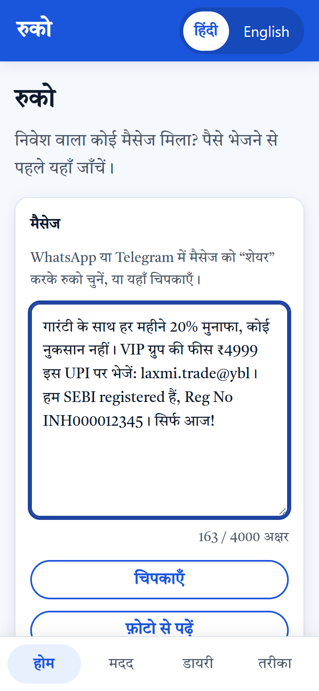
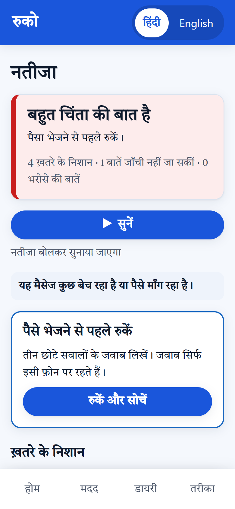
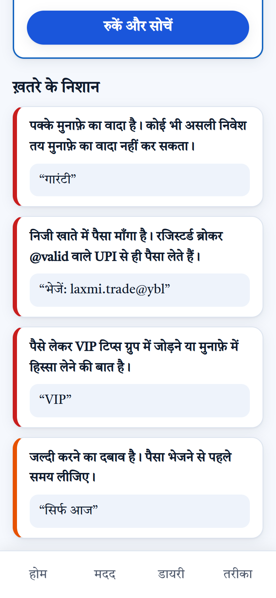
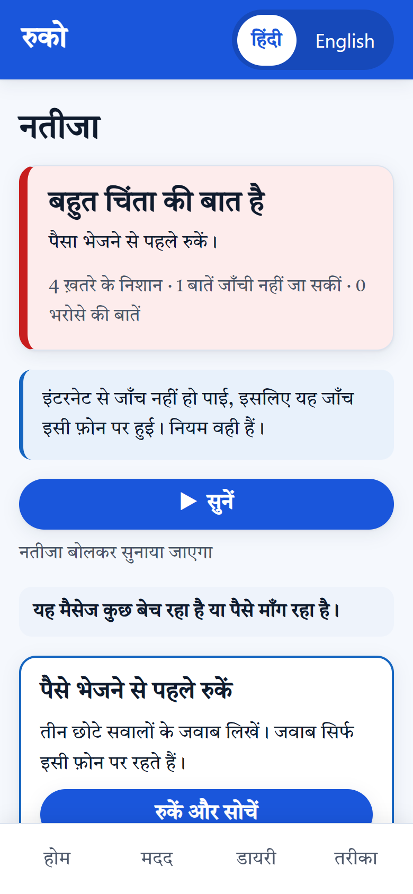
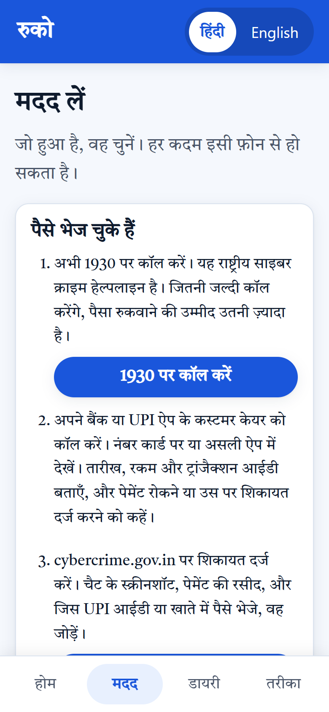
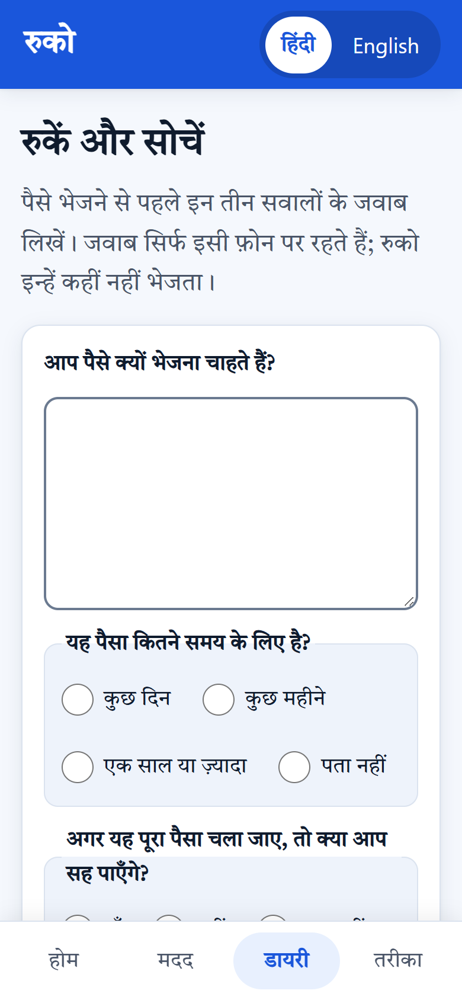
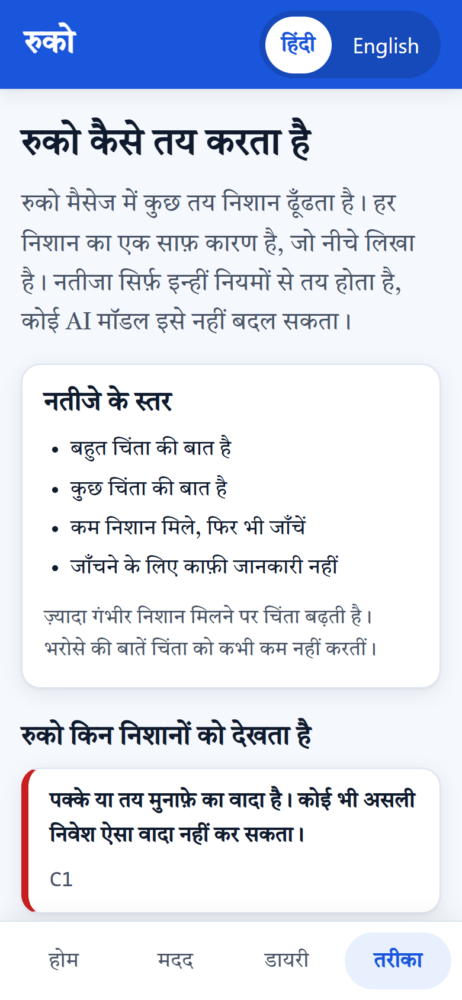
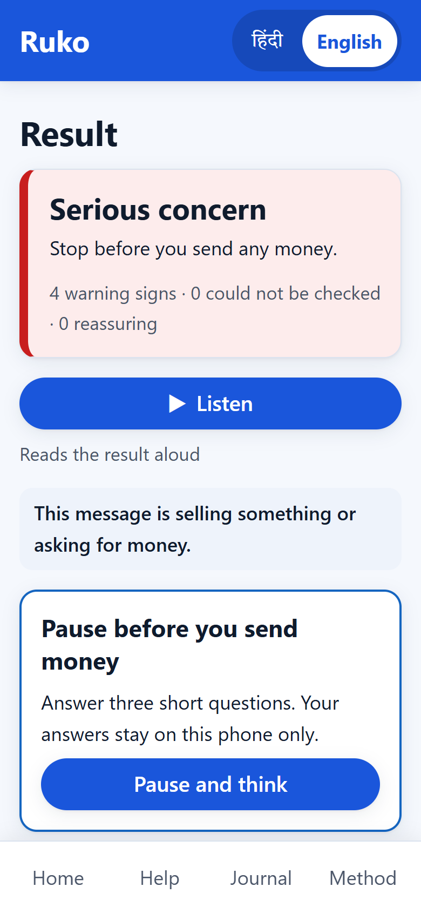
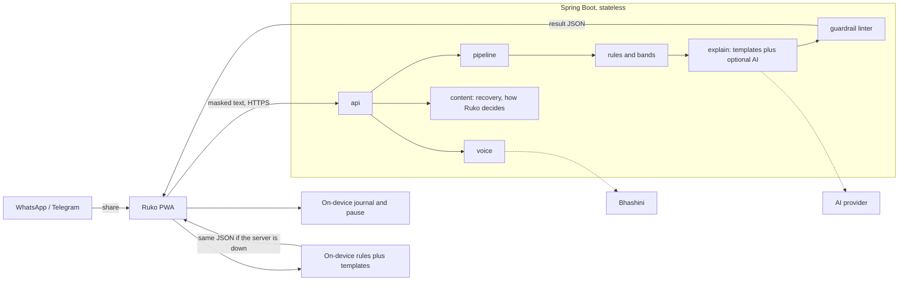

# Ruko (रुको)

**Stop before you pay.** Share an investment tip from WhatsApp or Telegram, hear its red flags in Hindi, pause, and then either verify on SEBI Check or follow the right recovery path.

**Live demo:** [ruko-187c.onrender.com](https://ruko-187c.onrender.com) (open on a phone and use **Add to Home screen**) · **API:** [swagger-ui](https://ruko-187c.onrender.com/swagger-ui.html)

Built for the SANGYAN Investor Resilience Hackathon (SEBI × NSDL × SnTC, IIT (BHU) Varanasi). Independent prototype: not an official SEBI or NSDL product, and no investment advice.

<table>
  <tr>
    <td align="center"><br><sub>Share or paste a message</sub></td>
    <td align="center"><br><sub>A clear, spoken result</sub></td>
    <td align="center"><br><sub>Each flag quotes the message</sub></td>
    <td align="center"><br><sub>Works offline, on the phone</sub></td>
  </tr>
  <tr>
    <td align="center"><br><sub>Already paid? Call 1930 first</sub></td>
    <td align="center"><br><sub>A 24-hour pause, kept on the phone</sub></td>
    <td align="center"><br><sub>How Ruko decides, in plain words</sub></td>
    <td align="center"><br><sub>Hindi or English</sub></td>
  </tr>
</table>

## Who it is for

Ramesh is 46 and runs a hardware shop in a small town in Uttar Pradesh. He reads Hindi first, uses a low-end Android phone on patchy data, and relatives have added him to "stock tips" groups. A message promises *guaranteed 20% a month*, asks for a *₹4999 VIP fee to a personal UPI ID*, quotes a *SEBI registration number*, and says *today only*. He has never used SEBI Check or SCORES and has not heard of the 1930 helpline. He won't read a long screen, but he will listen to a short answer. ([Persona and demo journey](./docs/persona.md))

## What Ruko does

1. **Share:** long-press the message, tap Share, and pick Ruko. Phone numbers, account numbers, Aadhaar, PAN, and OTPs are masked on the phone before anything is sent.
2. **Hear:** a short Hindi result gives the concern level, whether the message is selling something or teaching, the exact words that raised each flag, and one everyday analogy.
3. **Verify:** a registration number is shown as "couldn't verify", with one tap to SEBI Check.
4. **Pause:** three questions and a 24-hour wait. The answers never leave the phone.
5. **Get help:**
   - Already paid: call 1930, then the bank, then cybercrime.gov.in, with a ready complaint draft.
   - Broker problem: the SCORES steps.

It also works with no internet: the same rules run inside the app, and the phone's own voice reads the result.

## How it decides

- **Rules decide, not AI.** 19 signals live in one shared file (`shared/rules/signals.v0.json`), and the server and the phone read the same copy. The concern level is computed from the signals that fire.
- **An AI model is optional.** If one is configured, it may only add tags and card text. It never changes the result. It gets one call per request, with a 3-second limit and a fallback.
- **A guardrail linter checks every answer before it is shown.** Each answer must have:
  - no buy, sell, or hold;
  - no share names;
  - no "safe" or "scam" verdicts;
  - no price predictions;
  - only allowlisted links.

  If an answer fails, Ruko falls back to fixed template text.
- **Ruko never says a message is safe.** Every result ends with "No flags does not mean it is safe to send money."

## Results

From 80 labelled messages (40 scams, 25 education, 15 ambiguous; Hindi, English, and Hinglish). Full report: [docs/eval-report.md](./docs/eval-report.md).

| Measure | Result | Target |
| --- | --- | --- |
| Scams flagged (some concern or higher) | **40 / 40** | ≥ 90% |
| Genuine education wrongly flagged | **0 / 25** | ≤ 10% |
| Phone and server give the same answer | **80 / 80** | 100% |
| Answers that pass the guardrail linter | **320 / 320** | 100% |
| Server response time, p95 (AI off) | **14 ms** | ≤ 1.5 s |
| Largest result, compressed | **0.8 KB** | ≤ 6 KB |
| Message text found in server logs | **0** | 0 |

The fixtures were also used during development, so these numbers are optimistic. 9 known gaps are listed in the report. The behaviour study with real people has not been run yet (n = 0).

## Architecture



- **One container serves the app and the API on one domain.** It runs Java 21 in about 200 MB of a 512 MB instance.
- **Every outside service has a fallback:**
  - AI down: template text answers.
  - Bhashini down: the phone's own voice reads the result.
  - Server down: the rules run in the app.

More: [architecture slide](./docs/submission/architecture.md) · [technical notes](./docs/technical-notes.md).

## Privacy by design

- **The message lives for one request.** It is never stored, never logged, and never cached. A canary test checks the logs on every CI run.
- **The pause journal stays on the phone.** No server route can receive it, and a browser test proves no request carries it.
- **Ruko asks for few permissions.** The share target comes with installing the app. Clipboard and photo access happen only on tap, and notifications are optional. Ruko never uses the camera, location, or contacts. See the [permission list](./docs/submission/permissions.md).
- **Links go to official sites only:** SEBI Check, SCORES, cybercrime.gov.in, and the 1930 helpline. See the [link audit](./docs/submission/link-audit.md).
- **Errors never echo what was sent,** and secrets come only from the environment.

DPDP principles applied: notice, consent, purpose limitation, minimisation. This is not legal advice.

## Try it

With Docker:

```sh
docker build -t ruko .
docker run --rm -m 512m -p 8080:8080 ruko
```

Then open <http://localhost:8080>. The API page is at <http://localhost:8080/swagger-ui.html>.

For development (Java 21 and Node 24):

```sh
cd server && ./mvnw spring-boot:run      # API on :8081 (Windows: mvnw.cmd)
cd pwa && npm ci && npm run dev          # app on :5173, proxies /api to :8081
```

Ruko runs with no configuration. An AI provider (`LLM_*`) and Bhashini voice (`BHASHINI_*`) are optional, and their credentials come from environment variables only. To put it online, see [docs/deploy.md](./docs/deploy.md) (Render free tier, one Blueprint).

## Tests

```sh
cd server && ./mvnw verify               # 1420 tests: rules, linter, log audit, API surface, architecture
cd pwa && npm test                       # 253 tests: masking, on-device engine parity, recovery, journal
cd pwa && npm run build && npm run test:e2e   # 8 browser tests: journal privacy, accessibility, language
cd pwa && RUKO_URL=http://localhost:8080 npm run test:smoke   # live check: online, AI off, voice off, airplane mode
```

CI runs all of these on every push, builds the Docker image, and smoke-tests it in 512 MB.

## Project layout

| Path | What |
| --- | --- |
| `pwa/` | The app: React PWA with share target, on-device OCR, masking, rules engine, journal, and recovery |
| `server/` | Spring Boot API: analysis, voice, content, readiness, and the OpenAPI page |
| `shared/` | The single source both sides read: rules, catalogue text (Hindi and English), schemas, and labelled fixtures |
| `docs/` | Screenshots, evaluation, deploy guide, technical notes, study protocol, and the submission pack |
| `Dockerfile`, `render.yaml` | The deploy image and a Render Blueprint |

## Documentation

- [Final TRD](./Ruko%20—%20Final%20TRD.md): the product and architecture spec.
- [Technical notes](./docs/technical-notes.md): rules, linter, voice, on-device engine, evaluation, and pinned versions.
- [Deploy guide](./docs/deploy.md): Render or any Docker host, environment variables, and the smoke test.
- [Submission pack](./docs/submission/README.md): OpenAPI, linter report, link audit, permissions, architecture, deck, and disclaimer.
- [Evaluation report](./docs/eval-report.md), [accessibility checklist](./docs/accessibility.md), and [behaviour study protocol](./docs/study/README.md).

## Status

- **Built and tested:** Hindi and English, sharing and paste, photo OCR, the spoken result, offline mode, recovery, the complaint draft, the pause journal, and the deploy image.
- **Deployed:** [ruko-187c.onrender.com](https://ruko-187c.onrender.com); the live smoke test passes 7 / 7 ([report](./docs/submission/smoke-report.md)).
- **Off by default:** voice input (ASR) and domain-age lookup.
- **Still to do before the demo:**
  - run the behaviour study;
  - test Bhashini with real credentials;
  - load the dated NSE/BSE symbol list;
  - confirm the SEBI registration-prefix map against a SEBI page.
- **SEBI registration list:** there is no public list, so Ruko deep-links to SEBI Check and never says a number is verified.

## Disclaimer

Ruko is an independent prototype. It is not an official SEBI or NSDL product and is not endorsed by them. It gives no investment advice and never names a share. A result with no flags does not mean a message is safe.
