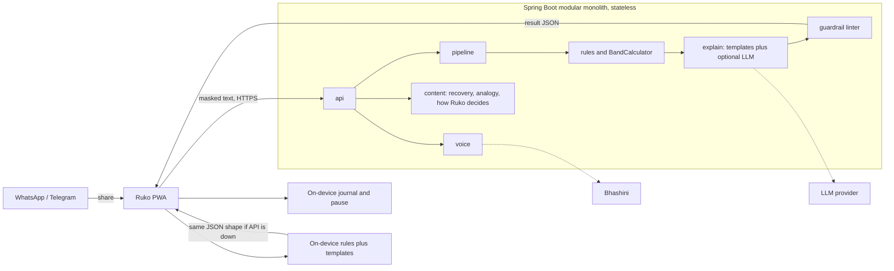

# Ruko (रुको) — Final TRD & Spring Boot Architecture

*v1.0 · 1 Oct 2026 · Build spec for SANGYAN Investor Resilience Hackathon (SEBI × NSDL × SnTC, IIT (BHU) Varanasi). Independent prototype. Not an official SEBI or NSDL product. No investment advice.*

## 0. Scope lock

One user, one journey: Ramesh shares a chat tip, hears the flags in Hindi, pauses, and either verifies on SEBI Check or, if he already paid, follows the right recovery path.

| Charter track | What ships in this build | What stays out |
| --- | --- | --- |
| A Fraud (primary) | Share-to-check, signal catalogue, bands, SEBI Check handoff, optional dated registration snapshot | Live SEBI API, deepfake detection model, fetching suspect sites |
| E Misinformation | `content_class`: education, promotion, or mixed, with a spoken card | YouTube or Instagram crawler, true/false verdicts |
| D Habits | On-device 24-hour pause and a three-line decision journal | Broker-linked cooling-off, trade history |
| C Education | One spoken analogy for the product the tip is selling | Course, crash simulator |
| B Rights | Two recovery paths (1930 and SCORES) and a ≤200-word editable draft | Nominee tracker, IEPF workflow |
| Open | Bhashini voice, large targets, screen-reader labels, on-device rules when the API is down | IVR, USSD, DigiLocker, Account Aggregator |

Depth rule: if a feature needs a second persona or a second demo, it is out.

## 1. Architecture



The PWA owns share target, on-device OCR, the editable transcript, PII masking, the pause journal, the evidence pack, the family card, and a copy of the rules engine. The backend is a stateless analysis, voice, and content service. The phone and the server read the same `signals.v0.json` and the same band function, so an offline result cannot drift from an online one.

**Design rules**

1. Request text lives for one request. It is never written to disk, logs, or the TTS cache.
2. Rules decide the band. The LLM may add tags and card text only.
3. Every external port has a deterministic fallback. The product works with the LLM and Bhashini both down, and with the API down.
4. The linter fails closed: template text, then a static pre-approved response.
5. One LLM call per request, 3-second hard timeout, circuit breaker.
6. TTS receives catalogue and template text only.
7. The public "How Ruko decides" page lists signal ids and plain reasons. Raw regex and rate-limit numbers are not on that page.
8. A dated SEBI snapshot can say "not in the list dated X". It cannot say "verified" or "safe".

**Stack.** Java 21, Spring Boot 3.5.x, Maven, Spring MVC on virtual threads (`spring.threads.virtual.enabled=true`). PWA: Vite + React, service worker, Tesseract.js (`hin` + `eng`). Pin versions on Day 1.

**Package layout (`in.ruko`)**

```text
api/         AnalysisController, VoiceController, ContentController, ComplaintController, dto/, error/
pipeline/    AnalysisService, InputGuard, TextNormalizer, PiiMasker
extract/     EntityExtractor, patterns/
rules/       SignalRule, RuleLoader, SignalEngine, BandCalculator, ContentClassifier
explain/     ExplainerPort, TemplateExplainer, AnalogyCatalog, LlmAssist, PromptFactory, SchemaGuard
guardrail/   GuardrailLinter, LintRule*, OutboundLinkPolicy, FallbackTemplates
snapshot/    SebiSnapshotIndex          // empty index is valid
voice/       VoicePort, BhashiniClient, AudioConverter, TtsCache
content/     RecoveryContent, HowRukoDecides, I18nBundle
infra/       RateLimitFilter, SafeLog, SecurityHeadersFilter, ResilienceConfig, MetricsConfig
resources/   rules/signals.v0.json, snapshot/sebi-intermediaries.json,
             i18n/messages_{hi,en}.properties, schemas/*.json, fixtures/
```

The PWA carries a generated TypeScript port of `SignalEngine`, `BandCalculator`, `ContentClassifier`, and the template bundle, produced from the same JSON in CI.

## 2. Signal catalogue (v1)

Rules live in `signals.v0.json`, validated at startup. A bad file aborts boot.

```json
{ "id": "C3", "severity": "CRITICAL", "type": "TERMS",
  "terms": ["anydesk", "teamviewer", "quicksupport"],
  "reasonKey": "sig.C3.reason", "spokenKey": "sig.C3.spoken",
  "analogyKey": "analogy.remote_access", "enabled": true }
```

Rule types: `TERMS`, `REGEX`, `PREFIX_MAP`, `ENTITY`, `LLM_TAG`.

| ID | Signal | Severity | Detection |
| --- | --- | --- | --- |
| C1 | Guaranteed, assured, or no-loss returns | Critical | Hi/En/Hinglish phrases + LLM tag |
| C2 | Personal UPI or account for invest, fee, or membership, and the handle is not `@valid` | Critical | UPI/account regex + pay verb in the same sentence |
| C3 | Remote-access app (AnyDesk, TeamViewer, QuickSupport) | Critical | App-name list |
| C4 | Trading app via APK or a non-store link | Critical | URL and file-type patterns |
| C15 | Impersonation of SEBI, NSDL, an exchange, or a government official | Critical | Phrase list |
| C16 | Fee, tax, or penalty to release profit, dividend, IPO allotment, or a blocked withdrawal | Critical | Phrase + amount or pay verb |
| C17 | QR or "scan to pay" tied to invest, fee, or membership | Critical | Phrase rules |
| S5 | Registration number malformed, or prefix does not match the claimed role | Strong | Regex + prefix map |
| S6 | "SEBI approved" or "SEBI guaranteed" | Strong | Phrase list |
| S7 | Paid VIP or premium group, or profit-sharing for tips | Strong | Keyword + amount |
| S8 | "Send funds to us and we will credit your account" | Strong | Phrase rules |
| S9 | Pre-announced target and timing on a named scrip. Flag the pattern only | Strong | Pattern + LLM tag |
| S10 | Look-alike or very new "broker" domain | Strong, flag off | RDAP + brand edit distance. Failure yields no flag |
| M11 | Urgency or scarcity | Moderate | Phrase rules |
| M12 | Profit screenshots or testimonials as proof | Moderate | LLM tag |
| M13 | Celebrity or finfluencer endorsement, including a forwarded voice or video | Moderate, always unverified | Name list, or `source=video\|audio`. Fixed card: face and voice were not checked |
| U14 | Registration number present | Unverified | Always. Action `sebi_check` |
| R1 | Payee uses an `@valid` handle | Weak reassurance | Regex. Band does not fall. Still verify on SEBI Check |
| R2 | Educational content: no payment ask, no return promise | Weak reassurance | Rules + LLM tag |

Prefix seed, confirmed against a SEBI source before the demo: INH research analyst, INA investment adviser, INZ stock broker, INP portfolio manager.

**Content class (Track E), derived after signals, never by the LLM alone**

- `promotion` — a payment ask, a return promise, a VIP fee, or any critical or strong signal
- `education` — R2 only, and no critical or strong signal
- `mixed` — an explanation together with a payment ask or a return promise
- `unknown` — nothing else matched

The result card states the class in plain Hindi. It does not say true or false.

**Analogy (Track C).** The highest-severity hit that has an `analogyKey` supplies one spoken analogy, at most 40 words, from the catalogue. Covered keys: guaranteed return, personal UPI, remote access, fee to unlock profit, F&O or leverage if those words appear. Missing key means no analogy. The model cannot invent one.

**Band**

```java
static Band band(Collection<SignalHit> hits, boolean unreadable) {
  if (unreadable) return Band.NOT_ENOUGH_TO_JUDGE;
  Map<Severity, Long> n = hits.stream()
      .map(h -> Map.entry(h.id(), h.severity())).distinct()
      .collect(Collectors.groupingBy(Map.Entry::getValue, Collectors.counting()));
  long c = n.getOrDefault(Severity.CRITICAL, 0L);
  long s = n.getOrDefault(Severity.STRONG, 0L);
  long m = n.getOrDefault(Severity.MODERATE, 0L);
  if (c >= 1 || s >= 2) return Band.HIGH_CONCERN;
  if (s == 1 || m >= 2) return Band.SOME_CONCERN;
  return Band.FEW_FLAGS_STILL_VERIFY;
}
```

Counts, not a percentage. `footer_key` is always `no_flags_not_safe`. R1 and R2 never lower the band. "Not enough to judge" means under `min-chars`, low OCR confidence, or under 50% letters.

**Snapshot lookup.** If `sebi-intermediaries.json` has a `snapshot_date` and a registration number is present:

- Found: add U14 with `snapshot: "listed"`. The band is unchanged. Copy still says verify on SEBI Check.
- Not found: add U14 with `snapshot: "not_listed"`. This is a strong signal S19, "number absent from the snapshot dated {date}", only when the file is non-empty.
- Empty file: U14 only, no S19, no "real-time" wording.

The snapshot stores registration numbers only. It is loaded at startup. The suspect URL is never fetched.

## 3. Pipeline

`POST /api/v1/analyze` body: `{text, lang, source, ocr_confidence?}`. `source` is `share | paste | ocr | asr | video | audio`.

1. `InputGuard`: at most 4000 characters, valid UTF-8, no binary.
2. `TextNormalizer`: NFKC, strip zero-width and control characters, collapse dotted obfuscation, Devanagari digits to ASCII, case-fold.
3. `PiiMasker`: phone numbers, 9–18 digit account numbers, 12-digit Aadhaar-like numbers, PAN, and OTP-after-keyword become `[PHONE]`, `[ACCT]`, `[AADHAAR]`, `[PAN]`, `[OTP]`. Copying a UPI id or account for SEBI Check happens on the device, from the pre-mask text held in memory on the phone.
4. `EntityExtractor`: registration `\bIN[A-Z]\d{9}\b`, UPI, IFSC, URLs, phones, return claims, app names, QR or scan-to-pay phrases.
5. `SignalEngine`, then optional LLM assist, then `ContentClassifier`, then `BandCalculator`, then analogy key, then linter.

```java
var hits   = engine.evaluate(ctx);
var assist = llm.assist(ctx.text(), hits);          // Optional; 3 s; failure is empty
hits = merge(hits, assist.tags());                  // additive, verbatim spans, LLM_TAG ids only
var band   = BandCalculator.band(hits, ctx.unreadable());
var klass  = ContentClassifier.classify(ctx, hits);
var draft  = composer.compose(ctx, hits, band, klass, assist);
var lint   = linter.lint(draft, ctx.text());
if (!lint.ok()) { draft = templates.compose(ctx, hits, band, klass); lint = linter.lint(draft, ctx.text()); }
if (!lint.ok()) draft = FallbackTemplates.generic(ctx.lang());
return draft;
```

LLM tags are limited to C1, S9, M12, and R2. Severity always comes from the catalogue. The span must appear verbatim in the input. Temperature 0. Output validated against `schemas/llm-assist.v1.json` with `additionalProperties: false`. The message sits in a delimited data block. Links in the message are not fetched.

**On-device path.** If `/analyze` fails or the device is offline, the service worker runs the same steps on already-masked text and returns the same schema with `engine: "on_device"`. OCR and the journal never need the server.

**Linter**

| Code | Check |
| --- | --- |
| L1 | Recommendation language in English, Hindi, and Hinglish, including buy, sell, and hold |
| L2 | Tickers from a dated NSE/BSE snapshot. Allow SEBI, NSDL, UPI, and IFSC |
| L3 | Verdicts: safe, scam, fraud, सुरक्षित, धोखेबाज़, except the fixed footer key |
| L4 | Card at most 25 words; analogy at most 40; evidence quote present in the input |
| L5 | Hosts inside `OutboundLinkPolicy`; no markup |
| L6 | Output language matches the request |
| L7 | Price targets or return predictions outside a quoted span |
| L8 | `content_class` and `band` match the rule result, so the model cannot relabel education as a clearance |

Tests: `LinterTest` on at least 200 outputs, `InjectionTest` (band and class unchanged), `OnDeviceParityTest` (same fixtures, same band and class).

## 4. Client behaviour

**Pause journal (Track D).** After a high or some concern result, the PWA shows three fields, stored in `localStorage` only: why they would send money, the time horizon, and whether this is money they can afford to lose. A "Wait 24 hours" control saves the local timestamp. Nothing is uploaded. The API has no journal route.

**Recovery (Track B).** Home and the result screen both open recovery.

- Money already sent: tap-to-call `tel:1930`, then the bank, then cybercrime.gov.in.
- Problem with a registered broker or depository participant: plain-Hindi SCORES steps and `https://scores.sebi.gov.in`.
- The complaint draft is a client template filled from on-device fields, at most 200 words, always editable. `POST /api/v1/complaint/draft` is the same template on the server for when the phone is online. Offline, the client template is enough.

**Family card** stays P1. The image is drawn on the device. The server supplies card copy and TTS audio only.

**Evidence pack** stays P1 and is a client-side PDF.

## 5. API

| Endpoint | Request | Response |
| --- | --- | --- |
| `POST /api/v1/analyze` | `{text, lang, source, ocr_confidence?}` | `AnalyzeResponse` |
| `POST /api/v1/voice/tts` | `{script_key, lang, counts}` | audio, or 503 `{fallback: "browser_tts"}` |
| `POST /api/v1/voice/asr` | multipart plus `X-Consent: voice-asr-v1` | `{transcript}` flag off by default |
| `GET /api/v1/content/recovery?lang=` | | `{cyber_fraud: [...], scores: [...]}` |
| `GET /api/v1/content/how-ruko-decides?lang=` | | signal ids, plain reasons, limits, snapshot date |
| `GET /api/v1/content/links` | | allowlisted links |
| `POST /api/v1/complaint/draft` | structured facts, no free-form scam essay | `{draft}` |
| `GET /actuator/health` | | status |

TTS takes a catalogue key and counts, not raw user text. The script is built on the server from properties files.

```json
{
  "language": "hi",
  "entities": {"upi_ids": ["name@okaxis"], "reg_numbers": ["INH000000000"], "urls": []},
  "signals": [{"id": "C2", "severity": "critical", "evidence": "Pay to name@okaxis", "reason": "..."}],
  "unverified": [{"id": "U14", "item": "INH000000000", "action": "sebi_check", "snapshot": "not_listed"}],
  "reassuring": [],
  "band": "high_concern",
  "content_class": "promotion",
  "counts": {"red_flags": 1, "couldnt_verify": 1, "reassuring": 0},
  "cards": [{"signal_id": "C2", "text": "..."}],
  "analogy_key": "analogy.personal_upi",
  "footer_key": "no_flags_not_safe",
  "engine": "template"
}
```

`engine` is `template`, `llm`, or `on_device`.

**Allowlist.** `siportal.sebi.gov.in`, `scores.sebi.gov.in`, `cybercrime.gov.in`. `tel:1930` is allowed as a telephone action, not a host. Saarthi is named as the official app; the link target is the SEBI Check page.

## 6. Voice, privacy, and config

Hindi and English ship. The next language after the sprint is named in the deck and is not built. Spoken copy is reviewed to about Class 6 Hindi.

`VoicePort` wraps Bhashini with a 3-second timeout. Failure returns 503 and the PWA uses `speechSynthesis`. ASR is flag-off: at most 2 MB, consent header required, `.opus` converted through ffmpeg stdin/stdout with no temp files, audio not retained.

Permissions are share target, microphone on tap, and optional notifications. Images stay on the device. Logs go through `SafeLog` (enums, ids, numbers). An ArchUnit rule forbids slf4j outside `SafeLog`. `NoContentLoggingTest` runs every fixture.

DPDP principles applied: notice, consent, purpose limitation, minimisation. This is not legal advice.

```yaml
spring:
  threads.virtual.enabled: true
  jackson.property-naming-strategy: SNAKE_CASE
  servlet.multipart.max-file-size: 2MB
server:
  compression.enabled: true
ruko:
  analyze:    { max-chars: 4000, min-chars: 20 }
  llm:        { enabled: true, timeout: 3s, base-url: ${LLM_URL}, api-key: ${LLM_KEY}, model: ${LLM_MODEL} }
  bhashini:   { enabled: true, timeout: 3s, user-id: ${BHASHINI_USER}, api-key: ${BHASHINI_KEY} }
  links:      { allow: [siportal.sebi.gov.in, scores.sebi.gov.in, cybercrime.gov.in] }
  rate-limit: { per-ip-per-min: ${RATE_LIMIT} }
  features:   { asr: false, complaint: true, s10-domain-age: false, snapshot: true }
```

Complaint defaults on because the SCORES path is part of the demo. S10 defaults off.

## 7. Build plan

| Phase | Day | Exit gate |
| --- | --- | --- |
| 0 Foundation | 1 | CI green; log-audit test exists; RFC 9457 errors that do not echo input |
| 1 Intake and extraction | 1 | ≥95% entity extraction on fixtures; WhatsApp share shows text |
| 2 Rules, class, band, snapshot | 2 | Every flag has a span; parity test scaffolded; snapshot empty-file path tested |
| 3 Explain, analogy, linter | 2 | 0 linter violations with the LLM off |
| 4 Voice hi/en | 2 | Spoken result with Bhashini down |
| 5 Recovery, journal, on-device engine | 3 | Both recovery paths; journal stays off the network; offline band matches the server on fixtures |
| 6 Study and eval | 3 | ≥80 labelled fixtures; study sheet filled; linter and log audit are CI gates |
| 7 Deploy and submit | 4 | Demo link, 3–5 min video, deck |

Day 1 also includes the persona, at least 40 test messages, the PWA shell, and the Bhashini application.

**Cut order if late:** S10, then ASR, then any third language, then the family card, then the server complaint route. The client complaint template, the journal, both recovery paths, the content class, the analogy, and on-device rules stay. The LLM is last to drop. Templates are the product.

**Submission pack:** OpenAPI page, linter report, permission list, link audit, `eval-report.md`, study sheet with sample size, architecture slide, snapshot date or an explicit "no public list, deep link only" line.

## 8. Evaluation

| Area | Method | Target |
| --- | --- | --- |
| Detection | ≥80 messages: about 40 scam, 25 education, 15 ambiguous | ≥90% of scams at some concern or higher; ≤10% of genuine education flagged |
| Content class | Same set, education and mixed labelled | Education messages come back `education` or `few_flags`, not high concern |
| Behaviour | 8–10 consenting adults, 10 messages, with and without Ruko | Report n; aim +30 pp correct identification and ≥80% who can restate the main reason |
| Guardrails | Linter and log audit | 100% pass; no message content in logs |
| Usability | Low-end Android, throttled 3G, TalkBack labels on the result screen | Text-path p95 ≤8 s; shell ≤200 KB gzipped; result ≤6 KB gzipped; server p95 ≤1.5 s with the LLM off |
| Parity | Fixtures through server and on-device engine | Same band and content class |

Metrics, with no content in tags: `ruko_analyze_total{band}`, `ruko_lint_fail_total{code}`, `ruko_llm_fallback_total`, `ruko_tts_fallback_total`, `ruko_on_device_total`, latency timers. Cost per check is LLM tokens times price.

## 9. Deploy

Multi-stage image on JRE 21, about 512 MB, `-XX:MaxRAMPercentage=75 -XX:+UseSerialGC`. Readiness runs three fixtures and re-validates rules. PWA and API share one domain. A keep-alive ping runs before the demo if the free tier sleeps.

Video beats: the message, share and spoken result including class and analogy, SEBI Check and the journal, already-paid 1930 path, SCORES path, then study numbers and guardrails.

## 10. Decisions still open on Day 1

1. LLM provider with strict JSON. `LlmPort` stays swappable.
2. Bhashini credentials and rate limits.
3. NSE/BSE symbol file date, and the prefix map checked against a SEBI page.
4. Whether a public registration-number file exists. If it does not, ship an empty snapshot and say so.
5. RDAP for S10. Default is off.
6. Host free-tier limits.
7. Whether 8–10 non-metro participants are available. If fewer are available, publish the actual n.
