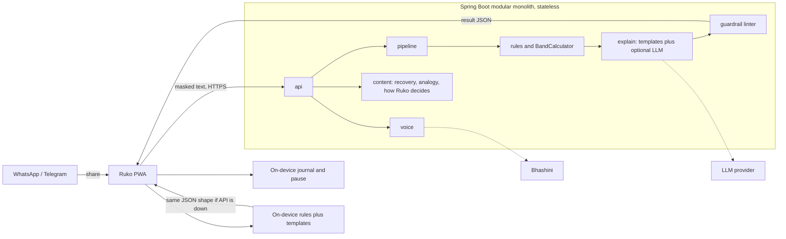
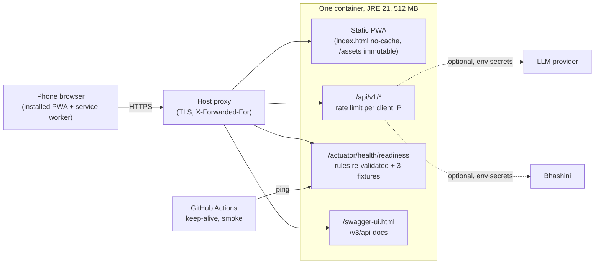

# Architecture

The slide, from TRD §1, plus how it is deployed.

**Design rules on one slide**

1. Request text lives for one request. Never written to disk, logs, or the TTS cache.
2. Rules decide the band. The LLM may add tags and card text only.
3. Every external port has a deterministic fallback: works with the LLM down, Bhashini down, and the API down (on-device engine).
4. The linter fails closed: composed draft, then template, then a static pre-approved response.
5. One LLM call per request, 3-second timeout, circuit breaker.
6. TTS speaks catalogue and template text only.
7. "How Ruko decides" lists signal ids and plain reasons, not patterns or limits.
8. A dated SEBI snapshot can say "not in the list dated X". It never says "verified" or "safe".

## Deployment

- **One origin.** The PWA build is packaged into the Spring Boot jar, so there is no CORS and the Content-Security-Policy stays `'self'`.
- **Image.** Multi-stage `Dockerfile`: Node 24 builds the PWA, JDK 21 builds the jar, JRE 21 runs it as a non-root user with `-XX:MaxRAMPercentage=75 -XX:+UseSerialGC`. Measured: ready about 2 s after start, about 190 MB used of a 512 MB limit.
- **Readiness.** The host only routes traffic once the rules compile again and three labelled fixtures (`sc-002`, `sc-008`, `ed-002`) come out with the expected band, class, and signals.
- **Secrets.** `LLM_*` and `BHASHINI_*` come from the host's environment. Nothing secret is in the repo or the image.
